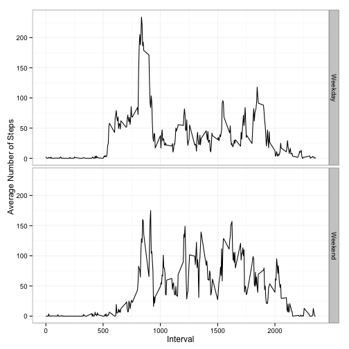

Peer Assessment 1 - Reproducable Research
========================================================


## Load and process the data

The first step is to load the file `activity.csv` from the working directory.


```r
activity.data <- read.csv("activity.csv")
```


## What is mean total number of steps taken per day?

In order to aggregate the step count data into days, we will use functions from the `dplyr` package.


```r
library(dplyr)
```

```
## 
## Attaching package: 'dplyr'
## 
## The following objects are masked from 'package:stats':
## 
##     filter, lag
## 
## The following objects are masked from 'package:base':
## 
##     intersect, setdiff, setequal, union
```

```r
activity.days <- activity.data %.% group_by(date) %.% summarise(steps = sum(steps, 
    na.rm = TRUE))
```


Using this aggregated data, which creates the sum of steps for each day in the dataset, we can:

* Plot a histogram of the total number of steps taken each day  
* Calculate the median total steps taken each day
* Calculate the mean total steps taken each day


```r
hist(activity.days$steps, main = "Histogram of total\nsteps taken each day", 
    breaks = 10)
```

 

```r

original.median <- median(activity.days$steps, na.rm = TRUE)
original.mean <- mean(activity.days$steps, na.rm = TRUE)


original.median <- format(original.median, nsmall = 2, big.mark = ",")
original.mean <- format(original.mean, nsmall = 2, big.mark = ",")
```


The calculated median of this data, ignoring `NA` values, is **10,395**.

The calculated mean of this data, ignoring `NA` values, is **9,354.23**.

## What is the daily activity pattern?

We can also aggregate the data in 5-minute intervals so we can plot the average daily movement pattern.


```r

activity.interval <- activity.data %.% group_by(interval) %.% summarise(steps = mean(steps, 
    na.rm = TRUE))

plot(activity.interval$interval, activity.interval$steps, type = "l", main = "Average Steps by 5 Minute Interval", 
    xlab = "Interval", ylab = "Average Number of Steps")
```

 


On average, the interval **`835`** contains the most steps on any given day.


```r
activity.interval$interval[activity.interval$steps == max(activity.interval$steps, 
    na.rm = TRUE)]
```

```
## [1] 835
```


## Imputing missing values


```r
na.idx <- is.na(activity.data$steps)

na.total <- sum(na.idx)
```


If we calculate total number of rows with `NA` values in the `steps` column, we can see that there are **2304** rows with missing data.

In order to impute the missing data, we will duplicate the dataset, then replace each `NA` value with the mean number of steps for that interval, using values the `activity.imputed` dataset.


```r
activity.imputed <- activity.data

for (i in seq_along(activity.imputed$steps)) {
    if (is.na(activity.imputed$steps[i])) {
        
        impute.data <- activity.interval[activity.interval$interval == activity.imputed$interval[i], 
            ]
        
        activity.imputed$steps[i] <- impute.data$steps
    }
    
}
```


Aggregating the imputed data, we can plot a histogram of the total number of steps taken each day and calculate the median and mean for total steps taken in a day with this new data.


```r
imputed.days <- activity.imputed %.% group_by(date) %.% summarise(steps = sum(steps))

hist(imputed.days$steps, main = "Histogram of total (imputed)\nsteps taken each day", 
    breaks = 10)
```

 

```r

imputed.median <- median(imputed.days$steps, na.rm = TRUE)
imputed.mean <- mean(imputed.days$steps, na.rm = TRUE)

imputed.median <- format(imputed.median, nsmall = 2, big.mark = ",")
imputed.mean <- format(imputed.mean, nsmall = 2, big.mark = ",")
```


How do the new median and mean calculations differ from the origninal?

| Data Type | Median | Mean |
|:------:|------:|-----:|
|Original| 10,395 | 9,354.23|
|Imputed| 10,766.19 | 10,766.19|

Two trends stand out:

1. The original median and mean are both lower than that of the imputed dataset.
2. There is no difference between the imputed median and mean, but there is a difference between the original median and mean.

## Are there differences in activity patterns between weekdays and weekends?

First, we need to create a factor variable, `day.type` to flag if a day is a weekday or a weekend day. To accomplish this, we will use the `ymd()` function from the `lubridate` package to convert the date strings into a weekday same, such as Monday, Tuesday, Wednesday, etc. We will then run a `for` loop to create a `day.type` column that will indicate if a particular observation is on a weekend (Saturay or Sunday) or a weekday (all other days).


```r
library(lubridate)

activity.data <- activity.data %.% mutate(weekday = weekdays(ymd(as.character(date))))

activity.data$day.type <- "Weekday"

for (j in seq_along(activity.data$weekday)) {
    if (activity.data$weekday[j] == "Saturday") {
        activity.data$day.type[j] <- "Weekend"
    }
    if (activity.data$weekday[j] == "Sunday") {
        activity.data$day.type[j] <- "Weekend"
    }
}

activity.data$day.type <- as.factor(activity.data$day.type)
```


We can then plot the data to see how daily activity patterns weekdays differ from the pattern on weekends.


```r

activity.daytype <- activity.data %.% group_by(day.type, interval) %.% summarise(steps = mean(steps, 
    na.rm = TRUE))

library(ggplot2)

ggplot(activity.daytype, aes(x = interval, y = steps, group = day.type)) + geom_line() + 
    facet_grid(day.type ~ .) + labs(x = "Interval", y = "Average Number of Steps") + 
    theme_bw()
```

 

